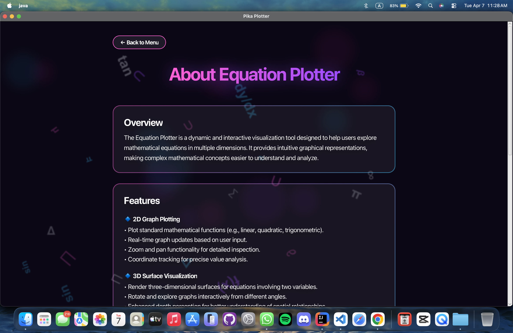
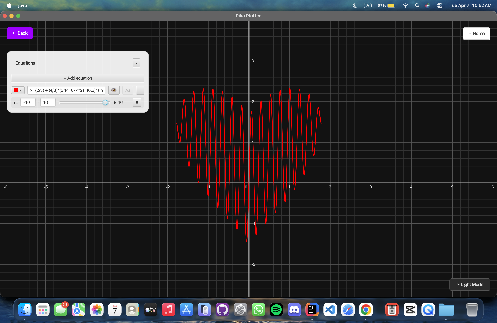
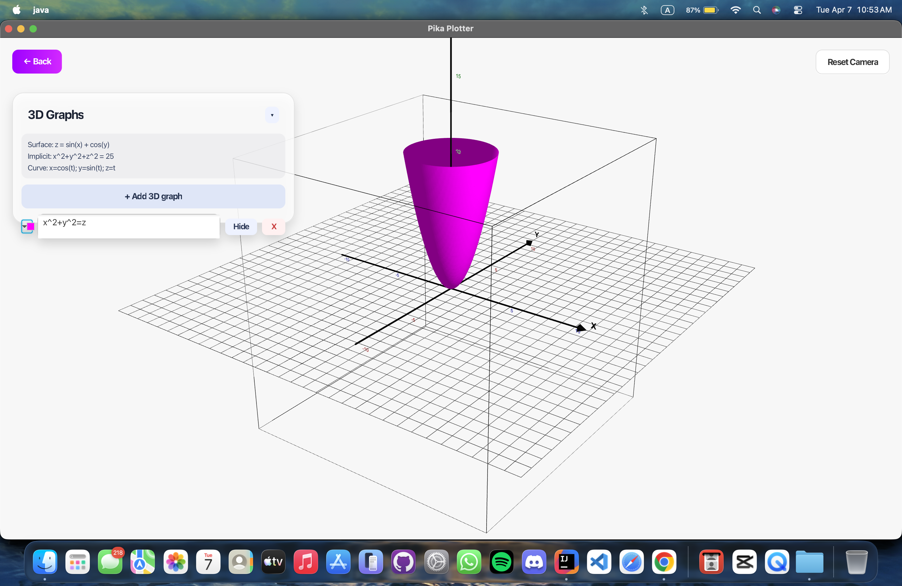
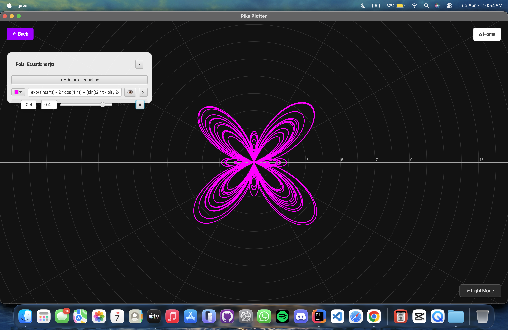

<div align="center">

# ✦ Pika Plotter ✦

### *The Ultimate High-Performance Mathematical Visualization Engine*

[](https://www.oracle.com/java/)
[](https://openjfx.io/)
[](LICENSE)

> *"Mathematics is the music of reason."*  
> — **James Joseph Sylvester**

</div>

---

## 🌌 An Elegant Interface: The Main Menu

<div align="center">
  
</div>

### ✧ A Beautiful Space for Infinite Visions
The application greets users with a visually stunning, dynamic environment. The UI is built entirely from scratch to provide a fluid and elegant visual experience, integrating premium **glassmorphism** design concepts. From here, users can seamlessly transition between 2D, 3D, and Polar graphing engines.

---

## 📐 2D Cartesian Engine: Precision & Dynamics

<div align="center">
  
</div>

### ✧ Features & Technical Implementation
* **Real-Time Graph Updates:** Plot standard mathematical functions (linear, quadratic, trigonometric) with instantaneous rendering.
* **Live Parameter Sliders ($a, b, c$):** Introducing an unknown variable auto-generates a sleek UI slider. Dragging it—or pressing the play/pause toggle—triggers a hardware-accelerated Canvas redraw, turning static formulas into fluid motion.
* **Interactive Navigation:** Full support for Zoom and Pan functionality for detailed mathematical inspection, complete with coordinate tracking for precise value analysis.

---

## 🧊 3D Surface Topology

<div align="center">
  
</div>

### ✧ Features & Technical Implementation
* **Multivariable Rendering:** Seamlessly isolate $x$, $y$, and $z$ planes, rendering three-dimensional surfaces for equations involving two variables (e.g., $x^2 + y^2 = z$).
* **Spatial Camera Controls:** Rotate and explore graphs interactively from varying angles. Users can click and drag to orbit around the topological surface.
* **Dynamic Multi-Graphing:** The 3D engine supports multiple concurrent inputs, allowing users to stack Standard Surfaces, Implicit 3D equations, and Parametric Curves simultaneously.

---

## 🌀 Polar & Parametric Kinematics

<div align="center">
  
</div>

### ✧ Features & Technical Implementation
* **Dynamic Angle-Based Rendering:** Plot equations in polar coordinates $r(\theta)$, ideal for visualizing circular, spiral, and periodic patterns.
* **Custom Radial Grid Engine:** Swaps the Cartesian grid for a concentric radial grid system tracking standard angle measures.
* **Parametric Time Sweeping ($t$):** Maps complex trigonometric outputs using dense step calculations to prevent aliasing during live temporal animations.

---

## 👨‍💻 About The Project & Credits

### ✧ Design Philosophy
Pika Plotter combines heavy mathematical functionality with high-end elegance. The interface was engineered to be intuitive, modern, and highly responsive, helping users maintain focus on learning and spatial exploration.

### ✧ Academic Credits
Developed as an academic project at **Bangladesh University of Engineering & Technology (BUET)**.

* **Developed By:** MD. Atik Khan & Debabrata Das Rahul
* **Supervisor:** MD Nurul Muttakin

We express our sincere gratitude to our supervisor for guidance and support throughout the development of this visualization engine.

---

## 🛠️ Installation & Build Instructions

Ensure you have **Java 21+** and **Apache Maven** installed.

```bash
# 1. Clone the repository
git clone [https://github.com/atikdevx/JAVA_FX.git](https://github.com/atikdevx/JAVA_FX.git)

# 2. Navigate into the directory
cd JAVA_FX

# 3. Clean and compile the application
mvn clean compile

# 4. Launch the Visualization Engine
mvn javafx:run
